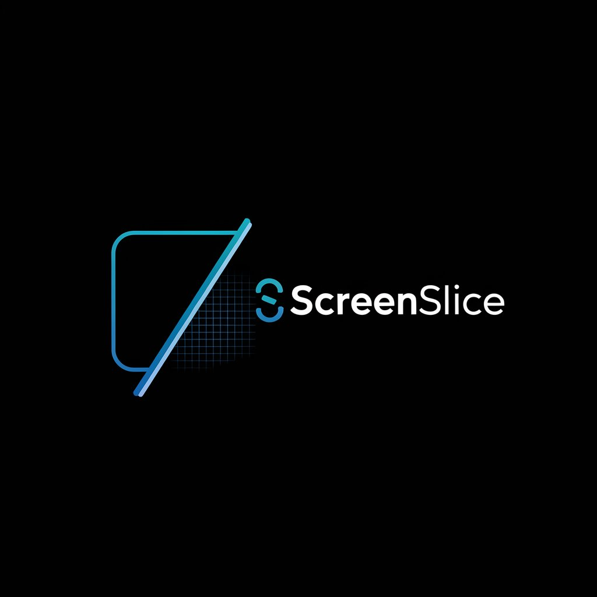

<p align="center">
  
</p>

<h1 align="center">🖼️ ✂️ ScreenSlice</h1>
<p align="center">
  <b>Capture Any Part of Your Screen with Pixel-Perfect Precision</b>  
</p>

<p align="center">
  
  
  
</p>

---

## ✨ **What is ScreenSlice?**  

**ScreenSlice** is a **free**, **open-source**, and **lightweight** tool for Windows 11 that allows you to **click & drag to select** any portion of your screen and instantly save its coordinates! 🎯  

💻 **Designed for:** Developers, designers, UI testers, automation workflows, and anyone who needs **pixel-perfect** screen selection!  

🔹 **Why ScreenSlice?**  
✅ **Multi-Monitor Support** – Works across multiple screens seamlessly.  
✅ **Dynamic Screenshot Overlay** – Captures a snapshot of your desktop with a stylish dark overlay for clarity.  
✅ **Real-Time Selection** – Click and drag with smooth, modern UI feedback.  
✅ **Instant JSON Output** – Saves coordinates as `selection.json`.  
✅ **Escape to Cancel** – Changed your mind? Press **ESC** to exit without saving!  

---

## 🖥️ **Screenshots**  

🚀 *Coming soon!* High-resolution images and GIFs showcasing **ScreenSlice** in action.  

---

## ⚡ **Installation**  

### 🔧 **Requirements**  
- **Python 3.6+**  
- **[PyQt5](https://pypi.org/project/PyQt5/)**  

### 📥 **Quick Start**  

1️⃣ **Clone the Repository:**  
```bash
git clone https://github.com/RorriMaesu/ScreenSlice.git
cd ScreenSlice
2️⃣ (Optional) Create a Virtual Environment:

bash
Copy
Edit
python -m venv venv
venv\Scripts\activate
3️⃣ Install Dependencies:

bash
Copy
Edit
pip install -r requirements.txt
4️⃣ Run ScreenSlice:

bash
Copy
Edit
python screen_selector.py
💡 Pro Tip: You can also use the start.bat file to launch ScreenSlice with a simple double-click! 🖱️

🎯 How to Use ScreenSlice
🖥️ When you launch ScreenSlice, a full-screen overlay will appear, displaying a captured image of your desktop with a sleek dark tint.

✂️ To Capture Your Screen:
🔹 Click & Drag – Click anywhere on the screen and drag to create a selection rectangle.
🔹 Release to Capture – The selection's global coordinates will be instantly saved to selection.json.
🔹 Cancel Anytime – Press ESC to exit without saving.

📁 File Structure
bash
Copy
Edit
📂 ScreenSlice/
 ├── 🖥️ screen_selector.py   # Main application source code
 ├── 📄 requirements.txt     # Python dependencies (PyQt5)
 ├── 📜 LICENSE              # MIT License (free and open-source)
 ├── 📖 README.md            # This file
 ├── 🖼️ logo.png             # Project logo
🤝 Contributing
💡 Have an idea for a new feature? Found a bug? We welcome contributions!

1️⃣ Fork the Repository
2️⃣ Create Your Feature Branch:

bash
Copy
Edit
git checkout -b feature/YourFeatureName
3️⃣ Commit Your Changes:

bash
Copy
Edit
git commit -m "Add some feature"
4️⃣ Push to the Branch:

bash
Copy
Edit
git push origin feature/YourFeatureName
5️⃣ Open a Pull Request 🎉

📌 For detailed guidelines, check out our CONTRIBUTING.md.

⚖️ License
📜 MIT License – Free for personal, academic, and commercial use.
🔗 See the full license details in LICENSE.

⭐ Show Your Support
If you find ScreenSlice useful, please consider giving it a ⭐ star on GitHub! It helps us grow and improve. 🚀

<p align="center"> <a href="https://github.com/RorriMaesu/ScreenSlice/stargazers">  </a> </p>
📬 Contact & Feedback
🛠️ Found a bug? Have a suggestion? Open an issue on GitHub:
👉 Report an Issue

<h3 align="center">🎨 Experience precision. Experience elegance. Experience ScreenSlice. ✂️</h3> ```
